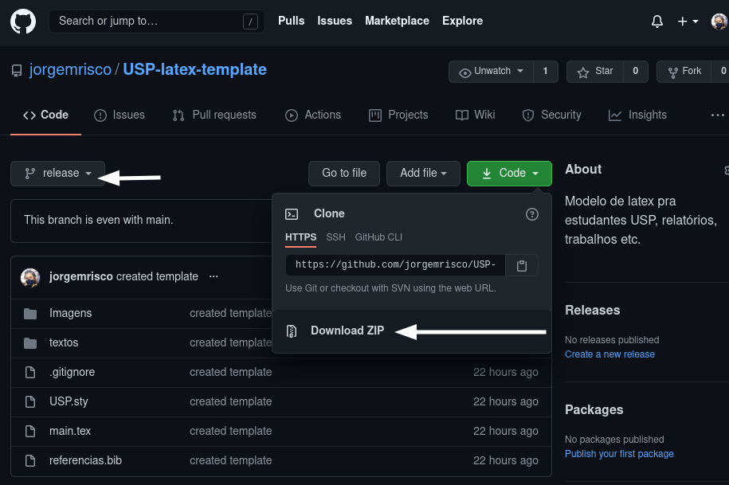
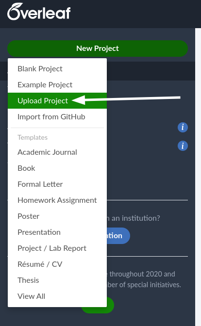
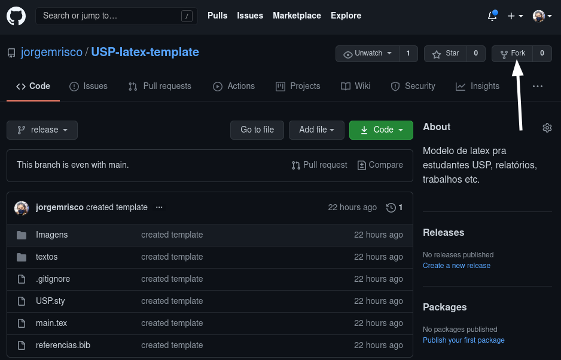

# Template para trabalhos

Para utilizar o template basta baixá-lo e importar no seu editor de latex preferido. Caso utilize o *overleaf* há uma opção para upload de .zip.

Baixe a última versão na [aba de release](https://github.com/jorgemrisco/USP-latex-template/releases)

# Como sugerir mudanças
Tenha o git instalado em seu computador (http://guides.beanstalkapp.com/version-control/common-git-commands.html) ou apenas edite o arquivo desejado pelo github.
Para sugerir as mudanças feitas realize um **pull request**: [Como criar uma pull request?](https://docs.github.com/pt/free-pro-team@latest/github/collaborating-with-issues-and-pull-requests/creating-a-pull-request)
Recomendo criar um fork deste repositório para realizar suas mudanças, após as mudanças aparecerá um botão para fazer a pull request no canto superior do github.

[How To: Fork a GitHub Repository & Submit a Pull Request](https://jarv.is/notes/how-to-pull-request-fork-github/)

Sugestões também podem ser deixadas na aba *Issues*
____________________________
Aviso: Este modelo não é oficial, apenas compartilho o modelo que chegou em minhas mãos após modificá-lo para maior praticidade de uso pessoal.
